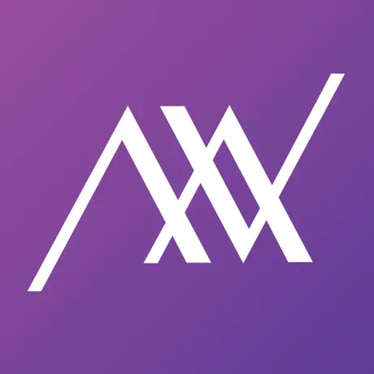
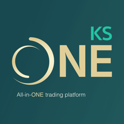

# Adisak Jarernpol
## Technical Lead Mobile iOS developer

👋 Hi, I'm A , I'm a passionate iOS Tech Lead with 5 years of experience in developing high-quality mobile applications.
Work in finance industry 8 years, so I have strong understanding of financial products and services.

## What I do past 5 years
- Time management and prioritization for deliver product on time
- Leadership abilities to guide and support a development team
- Design and implement system architecture
- Code review and provide guidance
- Troubleshoot and debug complex issues
- Optimize app performance and maintainability
- Looking help and support careers path for team members
  
## 🛠 Technical Skills
- Strong iOS development skills using `Swift` and `Objective-C`.
- Design Patterns `Clean Architecture`, `MVVM`, `MVC`, `MVP`
- Familiar with CI/CD process, with `Fastlane` and `Jenkins`
- Experience with unit both `XCTest` and `SwiftTesting`
- Experience with UI testing `Cucumber` and `XCUITest`
- Design architecture for APIs or Real-time data like `WebSockets`

## 📱 Featured Projects

### R'ket - Insightful Investment
**App Store Link**: [Download](https://apps.apple.com/th/app/rket-insightful-investment/id6445971302)

### AVA Advisor

- **App Store Link**: [Download](https://apps.apple.com/th/app/ava-advisor/id1204640737)

### KS One

- **App Store Link**: [Download](https://apps.apple.com/th/app/ks-one/id1605525381?l=th)

## 📫 Get in Touch
- Mobile: [0850592546](tel:+66850592546)
- Email: daisyfoto.ai@gmail.com